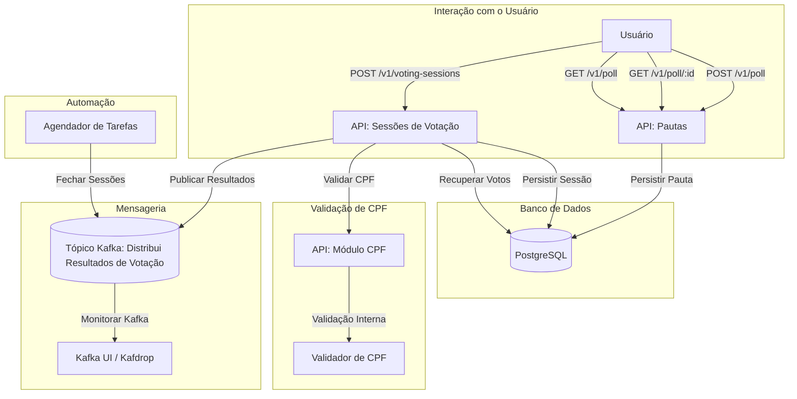
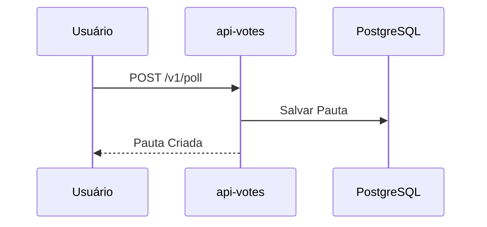
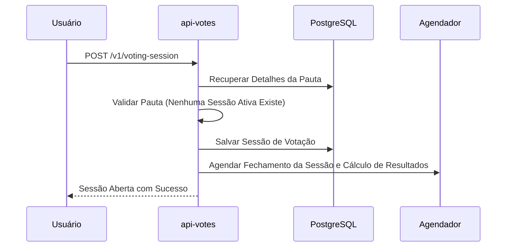
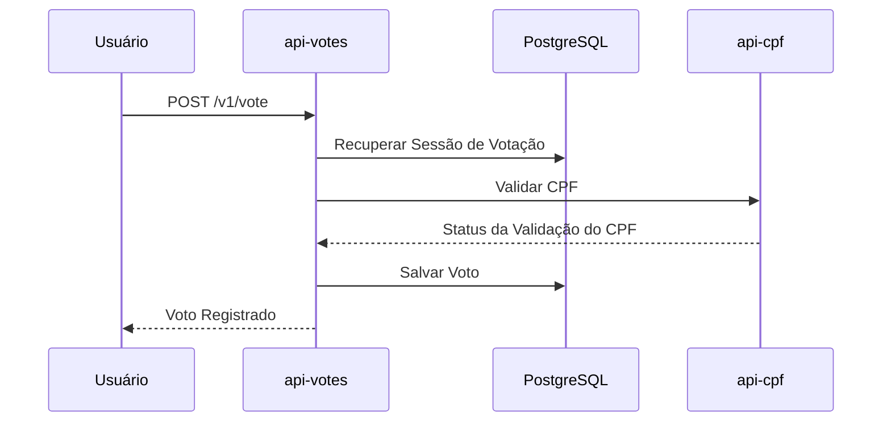
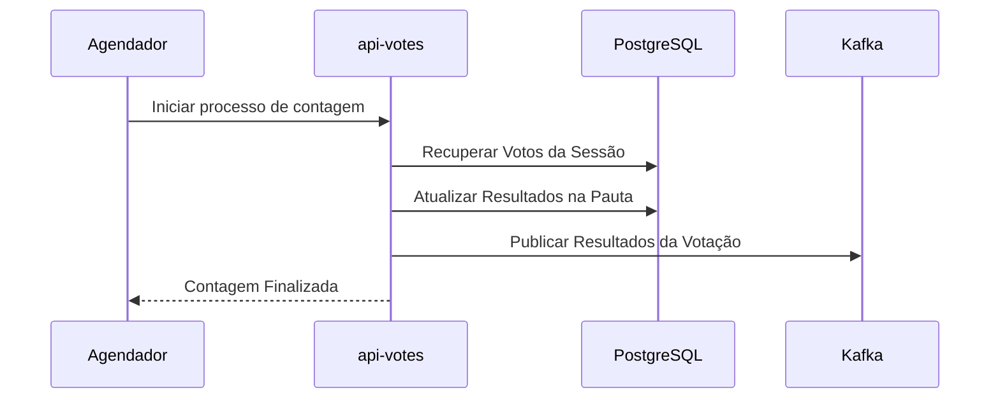

# Aplicação de Votação

Esta aplicação fornece uma API RESTful para gerenciar pautas e sessões de votação. Suporta a criação de pautas, abertura de sessões de votação, registro de votos e recuperação de resultados de votação. A integração para validação de elegibilidade de voto é gerenciada internamente através de um módulo dedicado (`api-cpf`).

## Funcionalidades

- **Pautas**: Os usuários podem criar e visualizar pautas.

    - Cada pauta pode ter apenas uma sessão, que pode ser aberta apenas uma vez.

- **Sessões de Votação**: Os usuários podem criar e visualizar sessões de votação.

    - Uma sessão só pode ser aberta para uma pauta específica.

- **Votos**: Os usuários podem votar em uma sessão de votação específica.

    - Um usuário pode votar apenas uma vez por CPF e somente enquanto a sessão de votação estiver aberta.

- **Integração Interna**

    - Validação de elegibilidade de voto via o módulo interno `api-cpf`.

- **Mensageria**

    - Publicar os resultados da votação em um tópico do Kafka (`voting-results`).

- **Processamento Agendado**

    - Os resultados da votação são calculados ao final do período da sessão de votação por um processo agendado.

## Tecnologias Utilizadas

- **Java 21**
- **Spring Boot 3.4**
    - Spring WebFlux (para programação reativa)
    - Spring Cloud OpenFeign (para comunicação entre módulos internos)
    - Spring Kafka (para mensageria)
- **PostgreSQL** (como banco de dados)
- **Kafka e Zookeeper** (para infraestrutura de mensageria)
- **Kafdrop e Kafka UI** (para monitoramento do Kafka)
- **Flyway** (para controle de versão do banco de dados)
- **JUnit 5** (para testes)

## Módulos Maven

Este projeto está estruturado como um projeto multi-módulo Maven com os seguintes módulos:

- **api-votes**: Lida com todas as operações relacionadas a votos, incluindo criação de pautas, gerenciamento de sessões de votação e cálculo de resultados. Comunica-se com o `api-cpf` para validar o CPF.
- **api-cpf**: Realiza a validação de CPF internamente. Este módulo não depende de APIs externas.

## Acessando a Aplicação

### Documentação da API com Swagger

A aplicação fornece uma documentação interativa da API via Swagger. Para acessá-la, execute a aplicação e visite:

- **Swagger UI (api-votes):** `http://localhost:8080/swagger-ui`
- **Swagger UI (api-cpf):** `http://localhost:8081/swagger-ui`

### Acessando o Kafka

- **Kafka Broker:** `localhost:9092`
- **Kafdrop UI:** `http://localhost:19000`
- **Kafka UI:** `http://localhost:18080`

### Acessando o PostgreSQL

- **Host:** `localhost`
- **Porta:** `5432`
- **Banco de Dados:** `test`
- **Usuário:** `root`
- **Senha:** `root`

## Diagrama de Fluxo da Aplicação



## Diagramas de Sequência

### 1. Registrar uma Nova Pauta



### 2. Abrir uma Sessão de Votação



### 3. Receber Votos dos Membros



### 4. Contar Votos



## Como Executar

### Pré-requisitos

- Java 21
- Docker Compose (para serviços de infraestrutura)

### Passos

1. Clone o repositório.
   ```bash
   git clone https://github.com/your-repo/voting-app.git
   cd voting-app
   ```
2. Inicie os serviços de infraestrutura usando o arquivo `docker-compose.yml` fornecido.
   ```bash
   docker-compose up -d
   ```
   Este comando inicia os seguintes serviços:
    - PostgreSQL: Banco de dados para dados da aplicação.
    - Zookeeper: Serviço de coordenação para Kafka.
    - Kafka: Serviço de mensageria para resultados de votação.
    - Kafdrop: Interface web para monitorar tópicos do Kafka.
    - Kafka UI: Interface amigável para gerenciar o Kafka.
3. Compile o projeto e seus módulos.
   ```bash
   ./mvnw clean package
   ```
4. Execute os módulos:
    - **api-votes**:
      ```bash
       ./mvnw spring-boot:run -pl api-votes
      ```
    - **api-cpf**:
      ```bash
       ./mvnw spring-boot:run -pl api-cpf
      ```

### Executando os Testes

- Execute a suíte de testes para todos os módulos.
  ```bash
  ./mvnw test
  ```

## Melhorias Futuras

- Implementar um cron job baseado em banco de dados que consulta uma tabela de controle para identificar sessões de votação expiradas. Essa abordagem centraliza o gerenciamento de estados de sessão, fornece melhor auditabilidade e simplifica a depuração.

- Adicionar suporte para paginação nas listagens de pautas e sessões.

- Melhorar o tratamento de erros e retornar mensagens de erro mais descritivas.

- Implementar validação adicional e recursos de segurança, como OAuth2.

## Observações

- **Desempenho:**

    - Para lidar com cenários envolvendo centenas de milhares de votos, eu optei por utilizar tecnologias que suportam alto desempenho, como o Spring WebFlux, que é reativo e otimiza o uso de threads.&#x20;
    - Se necessário, também podemos integrar o Redis para cache e reduzir a latência das respostas em operações de leitura frequentes.
    - Ferramentas como JMeter e Gatling podem ser usadas para simular cargas reais e garantir que a aplicação se comporta bem sob grande volume de votos.

- **Versionamento de API:**

    - Eu adotei uma estratégia de versionamento utilizando o número da versão na URL, como `/v1/poll`. Isso facilita a compatibilidade retroativa e permite que novas versões sejam implementadas sem quebrar funcionalidades existentes.
    - Escolhi essa abordagem porque ela é simples de implementar e entender, mas também estou aberto a explorar o uso de cabeçalhos específicos para maior flexibilidade.

- **Processo de Contagem e Fechamento:**

    - Decidi usar um agendador (Task Scheduler) para automatizar o fechamento das sessões de votação e calcular os resultados. Isso garante que o sistema gerencie os tempos de forma confiável, sem depender de intervenções externas.
    - Caso a aplicação precise de maior escalabilidade, podemos implementar um cron job baseado em tabelas de controle no banco de dados, que seria mais auditável e flexível para reexecução ou reparos.

## Contato

Para quaisquer dúvidas ou sugestões, entre em contato pelo e-mail [roger.bleggi@hotmail.com](mailto\:roger.bleggi@hotmail.com)

